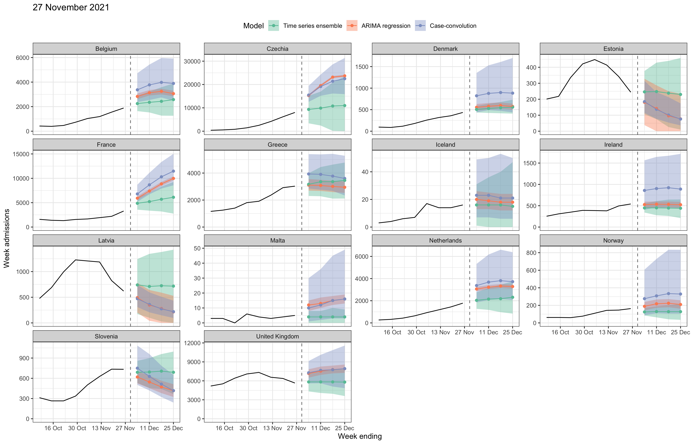

# COVID-19 hospital admissions forecasts for the ECDC Forecast Hub

## Current forecasts

The most recent forecasts (from 27 November 2021) cover the following
locations: Belgium (BE), Czechia (CZ), Denmark (DK), Estonia (EE),
France (FR), Greece (GR), Iceland (IS), Ireland (IE), Latvia (LV), Malta
(MT), Netherlands (NL), Norway (NO), Slovenia (SI), United Kingdom (GB).

## Methods

### Autoregressive time series ensemble

A mean ensemble of three autoregressive time series models: ARIMA, ETS
and a “naive” model (where future admissions are equal to the
most-recently observed admissions). Each of the three time series models
are fit independently to weekly incident admissions data. The
mean-ensemble quantile forecast is made by taking the mean of the three
quantile forecasts.

### ARIMA regression

A regression model with ARIMA errors, with 1-week lagged COVID-19 cases
as a predictor. The model is fit with weekly admissions/cases data. To
make forecasts of future admissions for a forecast horizon of two weeks
or more, we use the [ECDC Hub ensemble case
forecast](https://github.com/epiforecasts/covid19-forecast-hub-europe/tree/main/data-processed/EuroCOVIDhub-ensemble).

### Case convolution

A convolution of COVID-19 cases and a report-to-admission delay
distribution. The model is fit with weekly admissions/cases data. To
make forecasts of future admissions, we use the [ECDC Hub ensemble case
forecast](https://github.com/epiforecasts/covid19-forecast-hub-europe/tree/main/data-processed/EuroCOVIDhub-ensemble).
